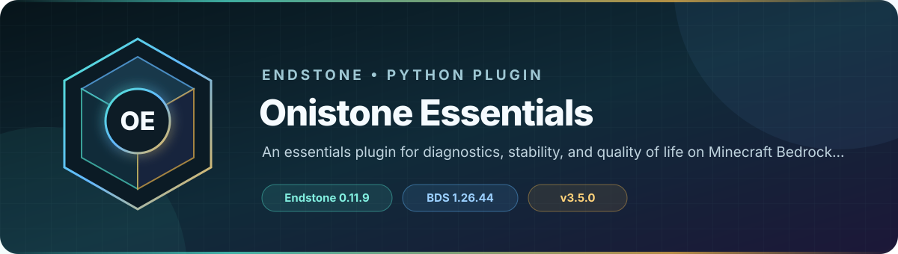

<!-- endstone-professional-header:start -->
<p align="center">
  
</p>

<p align="center">
  <a href="https://github.com/TheNINJALLO/endstone-essentialsbds/actions/workflows/wheel-release.yml"></a>
  <a href="https://github.com/TheNINJALLO/endstone-essentialsbds/releases/latest"></a>
</p>

<p align="center">
  
  
  
  =3.10" src="https://img.shields.io/badge/Python-%3E=3.10-3776AB?style=flat-square&amp;logo=python&amp;logoColor=white">
</p>

<p align="center">
  <strong>An essentials plugin for diagnostics, stability, and quality of life on Minecraft Bedrock Edition.</strong>
</p>

<p align="center">
  <a href="#what-it-does">What it does</a> &bull;
  <a href="#how-to-use">How to use</a> &bull;
  <a href="#commands-and-permissions">Commands</a> &bull;
  <a href="#install">Install</a> &bull;
  <a href="https://github.com/TheNINJALLO/endstone-essentialsbds/releases">Releases</a>
</p>

## Overview

An essentials plugin for diagnostics, stability, and quality of life on Minecraft Bedrock Edition. This release is aligned with Endstone 0.11.9 and Minecraft Bedrock Dedicated Server 1.26.44, and is distributed as a Python wheel for direct installation in an Endstone server.

## What it does

- Provides a broad essentials suite covering gamemodes, item tools, messaging, moderation, teleport utilities, diagnostics, permissions, and ranks.
- Loads each command as a separate configurable module so unwanted commands can be disabled.
- Adds configurable chat, join/leave, combat, monitoring, multiworld, and server-stability behavior.
- Includes an in-game permissions manager for rank sets, per-player overrides, inheritance, and rank appearance.

## How to use

1. Start once to generate `plugins/onistone_essentials/` with the main settings, command-module configuration, permissions, databases, and rules files.
2. Run `/rank` as an operator to open the **Onistone Permissions** manager.
3. Select a rank set, select a permission category, choose a permission from the dropdown, and set it to **Allow**, **Deny**, or **Inherit / neutral**.
4. Open **Edit title, color & settings** to rename a visible title such as `Admin`, choose its Minecraft color, toggle brackets, set inheritance, and adjust weight or suffix.
5. Use **Manage player overrides** or `/permissions <player>` when one player needs an exception to their rank.

Existing installations are migrated automatically on first start. Configuration, databases, ranks, and player permission overrides are retained, and old permission entries are translated to the `onistone.*` namespace.

### Permissions GUI

- `/rank` or `/rank gui` opens the complete rank-set manager.
- `/permissions` opens the online-player override picker.
- `/permissions <player>` edits an online or known offline player's overrides.
- `/permissionslist [player]` remains available for a read-only permission audit.
- Existing `/rank set`, `/rank perm`, `/rank prefix`, `/rank suffix`, `/rank inherit`, and direct `/permissions ... settrue|setfalse|setneutral` commands remain available for console use and automation.

## Commands and permissions

| Command / usage | What it does | Access |
|---|---|---|
| `/gma [player: player]` | Sets your game mode to adventure! | `onistone.command.gma` |
| `/gmc [player: player]` | Set your own or another player's game mode to Creative | `onistone.command.gmc` |
| `/gms [player: player]` | Set your own or another player's game mode to Survival | `onistone.command.gms` |
| `/gmsp [player: player]` | Sets your game mode to spectator! | `onistone.command.gmsp` |
| `/gmt [player: player]` | Toggles you between survival and creative mode! | `onistone.command.gmt` |
| `/iteminfo [player: player] (slot\|helmet\|chestplate\|leggings\|boots\|mainhand\|offhand)[slotTypeInfo: slotTypeInfo] [slot: int]` | Check item data! | `onistone.command.iteminfo` |
| `/itemlore <player: player> (add)<add_lore: add_lore> <item_lore: string> (slot\|helmet\|chestplate\|leggings\|boots\|mainhand\|offhand)[slotType: slotTypeAddLore] [slot: int]`<br>`/itemlore <player: player> (set)<set_lore: set_lore> <replaced_lore: string> (slot\|helmet\|chestplate\|leggings\|boots\|mainhand\|offhand)[slotType: slotTypeSetLore] [slot: int]`<br>`/itemlore <player: player> (delete)<delete_lore: delete_lore> [item_lore_line: int] (slot\|helmet\|chestplate\|leggings\|boots\|mainhand\|offhand)[slotType: slotTypeDeleteLore] [slot: int]`<br>`/itemlore <player: player> (clear)<clear_lore: clear_lore> (slot\|helmet\|chestplate\|leggings\|boots\|mainhand\|offhand)[slotType: slotTypeSlotClearLore] [slot: int]`<br><sub>Aliases: `/lore`</sub> | Modify item lore data! | `onistone.command.itemlore` |
| `/itemname <player: player> (set)<set_name: set_name> <item_name: string> (slot\|helmet\|chestplate\|leggings\|boots\|mainhand\|offhand)[slotType: slotTypeSetName] [slot: int]`<br>`/itemname <player: player> (clear)<clear_name: clear_name> (slot\|helmet\|chestplate\|leggings\|boots\|mainhand\|offhand)[slotType: slotTypeClearName] [slot: int]` | Modify item name data! | `onistone.command.itemname` |
| `/itemtag <player: player> (unbreakable)<itemTag: itemTag> <is: bool> (slot\|helmet\|chestplate\|leggings\|boots\|mainhand\|offhand)[slotTypeTag: slotTypeTag] [slot: int]` | Modify item tags! | `onistone.command.itemtag` |
| `/more` | Sets a full stack to the held item! | `onistone.command.more` |
| `/repair [player: player]` | Repairs the item in hand! | `onistone.command.repair`, `onistone.command.repair.other` |
| `/spectate [player: player]` | Warps you to a non-spectating player! | `onistone.command.spectate` |
| `/broadcast <message: message>` | Send a server-wide notification! | `onistone.command.broadcast` |
| `/clearchat` | Adds 100 empty lines to chat! | `onistone.command.clearchat` |
| `/note <player: player> (clear)<note_clear: note_clear>`<br>`/note <player: player> [page: int]`<br>`/note <player: player> (remove)<note_remove: note_remove> <id: int>`<br>`/note <player: player> (add)<note_add: note_add> <message: message>` | Manage mod notes on players! | `onistone.command.note` |
| `/popup <player: player> <text: message>` | Sends a custom popup message! | `onistone.command.popup` |
| `/tip <player: player> <text: message>` | Sends a custom tip message! | `onistone.command.tip` |
| `/toast <player: player> <title: string> <text: message>` | Sends a custom toast message! | `onistone.command.toast` |
| `/blockinfo [location: pos]` | Prints info of the facing block! | `onistone.command.blockinfo` |
| `/blockscan (disable)[blockscan: blockscan]` | Continuously show information about the block you're looking at. | `onistone.command.blockscan` |
| `/check <player: player> (info\|mod\|jail\|network\|world)[info: info]`<br><sub>Aliases: `/seen`</sub> | Checks a player's client info! | `onistone.command.check` |
| `/entityinfo (list)[entity_action: entity_action] [page: int]` | Check entity information! | `onistone.command.entityinfo` |
| `/heal [player: player]` | Sets player health to full! | `onistone.command.heal`, `onistone.command.heal.other` |
| `/ping [player: player]` | Checks the server ping! | `onistone.command.ping` |
| `/jail <player: player> <jail: string> <duration_number: int> (second\|minute\|hour\|day\|week\|month\|year)<duration_length: jail_length> [reason: message]`<br>`/jail <player: player> <jail: string> (forever)<perm_jail: perm_jail> [reason: message]` | Jails a player to a specified area! | `onistone.command.jail` |
| `/jails (list)[list_jails: list_jails]`<br>`/jails (create\|delete\|tp)<jail_action: jail_action> <jail: string> [location: pos]` | Manages server jails! | `onistone.command.jails` |
| `/nameban <player: player> <duration_number: int> (second\|minute\|hour\|day\|week\|month\|year)<duration_length: name_ban_length> [reason: message]`<br>`/nameban <player: player> (forever)<name_ban: name_ban> [reason: message]` | Bans a player's name from the server, either temporarily or permanently! | `onistone.command.nameban` |
| `/unnameban <player: player>` | Removes an active name ban from a player! | `onistone.command.unnameban` |
| `/permban <player: player> [reason: message]` | Permanently bans a player from the server! | `onistone.command.permban` |
| `/punishments <player: player> [page: int]`<br>`/punishments <player: player> (remove\|clear) <punishment_removal: remove_punishment_log>` | Manage punishment history of a specified player! | `onistone.command.punishments` |
| `/removeban <player: player>`<br>`/removeban <player: player> (ip)<perm_removeban: perm_removeban>` | Removes an active ban from a player! | `onistone.command.removeban`, `onistone.command.pardon` |
| `/tempban <player: player> <duration_number: int> (second\|minute\|hour\|day\|week\|month\|year)<duration_length: ban_length> [reason: message]` | Temporarily bans a player from the server! | `onistone.command.tempban` |
| `/unjail <player: player>` | Free a jailed player! | `onistone.command.unjail` |
| `/unwarn <player: player> (clear)<warn_action: warn_action>`<br>`/unwarn <player: player> [id: int]` | Remove a warning or clear all warnings from a player! | `onistone.command.unwarn` |
| `/vanish` | Completely hide your server visibility! | `onistone.command.vanish` |
| `/warn <player: player> <reason: string> [duration_number: int] (second\|minute\|hour\|day\|week\|month\|year)[duration_length: warn_length]` | Warn a player that they are breaking a rule! | `onistone.command.warn` |
| `/warnings <player: player> [page: int]`<br>`/warnings <player: player> (delete\|clear)<del_warn: del_warn> [id: int]` | List warnings or permanently delete warnings from a player! | `onistone.command.warnings` |
| `/bottom` | Warps you to the nearest air pocket below you! | `onistone.command.bottom` |
| `/offlinetp [player: player]`<br><sub>Aliases: `/otp`</sub> | Teleport to where a player last logged out. | `onistone.command.offlinetp` |
| `/spawn` | Warps you to the spawn! | `onistone.command.spawn` |
| `/top` | Warps you to the topmost block with air! | `onistone.command.top` |
| `/monitor (server\|packets\|disable)[debug: debug]` | Monitor server performance in real time! | `onistone.command.monitor` |
| `/permissions`<br>`/permissions <player: player>`<br>`/permissions <player: player> (settrue\|setfalse\|setneutral)<set_perm: set_perm> <perm: string>`<br><sub>Aliases: `/perms`</sub> | Opens the player-override GUI or directly updates a player permission. | `onistone.command.permissions` |
| `/permissionslist`<br><sub>Aliases: `/permslist`</sub> | View the global or player-specific permissions list! | `onistone.command.permissionslist` |
| `/rank`<br>`/rank gui`<br>`/rank (set)<rank_set: rank_set> <player: player> <rank: string>`<br>`/rank (prefix\|suffix)<rank_meta: rank_meta> <rank: string> <meta: message>`<br>`/rank (perm)<rank_perm: rank_perm> (add\|remove)<perm_action: perm_action> <rank: string> <perm: string> [state: bool]`<br>`/rank (weight)<rank_weight: rank_weight> <rank: string> <weight: int>`<br>`/rank (inherit)<rank_inherit: rank_inherit> <rank_child: string> <rank_parent: string>`<br>`/rank (create\|delete\|list\|info)<rank_action: rank_action> [rank: message]` | Opens the rank GUI or directly manages ranks. | `onistone.command.rank` |
| `/reloadscripts`<br><sub>Aliases: `/rscripts`, `/rs`</sub> | Reloads the server scripts! | `onistone.command.reloadscripts` |

## Compatibility

| Component | Supported version |
|---|---|
| Endstone | `0.11.9` |
| Endstone API | `0.11` |
| Bedrock Dedicated Server | `1.26.44` |
| Python | `>=3.10` |
| Plugin release | `v3.5.0` |

## Install

Download the wheel from the matching GitHub release:

```bash
gh release download v3.5.0 --repo TheNINJALLO/endstone-essentialsbds --pattern "*.whl"
```

Copy the downloaded wheel into the server's `plugins/` directory, remove any older wheel for the same plugin, and restart Endstone.

> [!IMPORTANT]
> Use Endstone `0.11.9` with BDS `1.26.44`. Back up worlds and plugin data before upgrading a production server.

## Configuration and secrets

Runtime databases, logs, local `.env` files, server directories, and root `config.toml` files are excluded from source releases. When an example configuration is provided, copy it locally and keep live tokens, passwords, webhook URLs, and server identifiers out of Git.

## Release automation

Every `v*` tag runs [the wheel release workflow](.github/workflows/wheel-release.yml), builds the package in a clean GitHub runner, stores the wheel as a workflow artifact, and attaches it to the matching GitHub release.
<!-- endstone-professional-header:end -->
